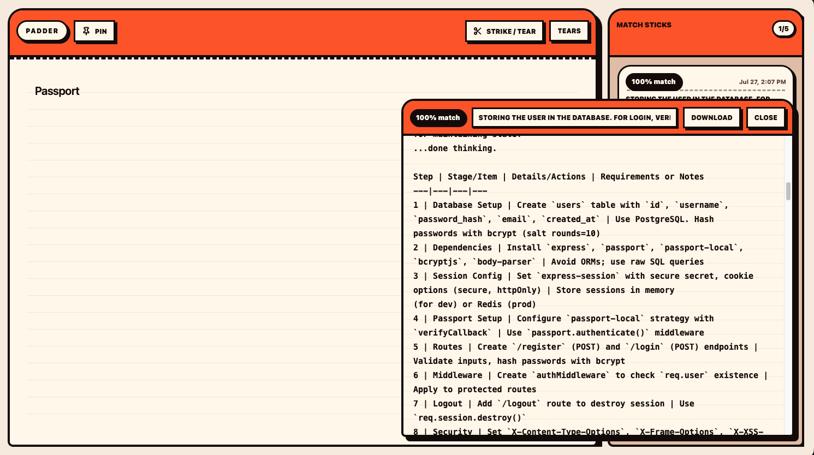
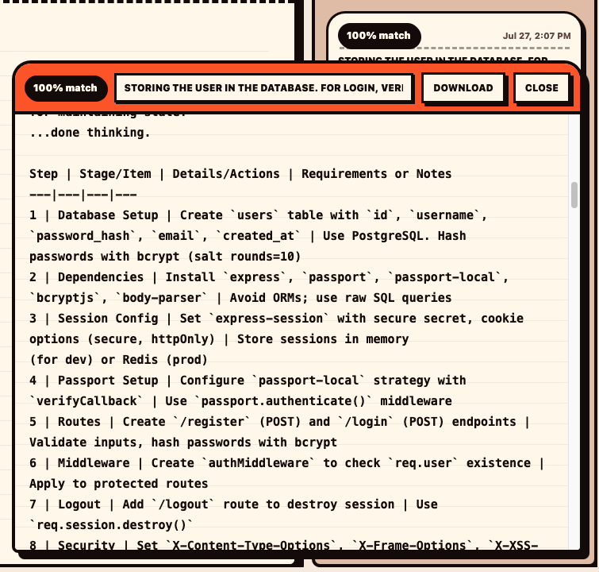

<div align="center">

# Padder

### Write now. Find it later.

A scratch pad that finds related saved notes while you type.

</div>

<p align="center">
  
</p>

## Overview

Padder keeps quick writing simple. Write on one clean page, tear it away when it is finished, and Match Sticks surfaces related saved notes as you type. That prevents duplicate entries, reduces clutter, and turns the pad into a natural search surface.

## Features

- Write without choosing a folder, title, or form
- See related saved notes while typing
- Tear a page to file it locally
- Pin the window when it needs to stay visible
- Open or download any matching note

## How it works

1. Start typing on the pad.
2. Review any related notes shown in Match Sticks.
3. Tear the page when the note is complete.

<p align="center">
  
</p>

## Built with

Electron · React · TypeScript · Vite · electron-store

## Run locally

```bash
npm install
npm run dev
```

## Privacy

No account. Notes are stored locally on the Mac.
